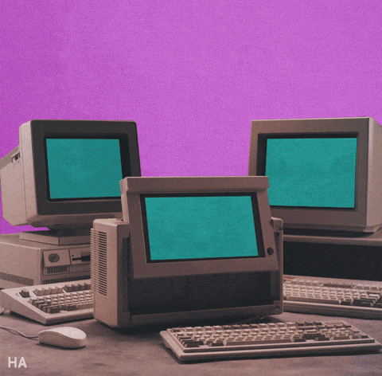
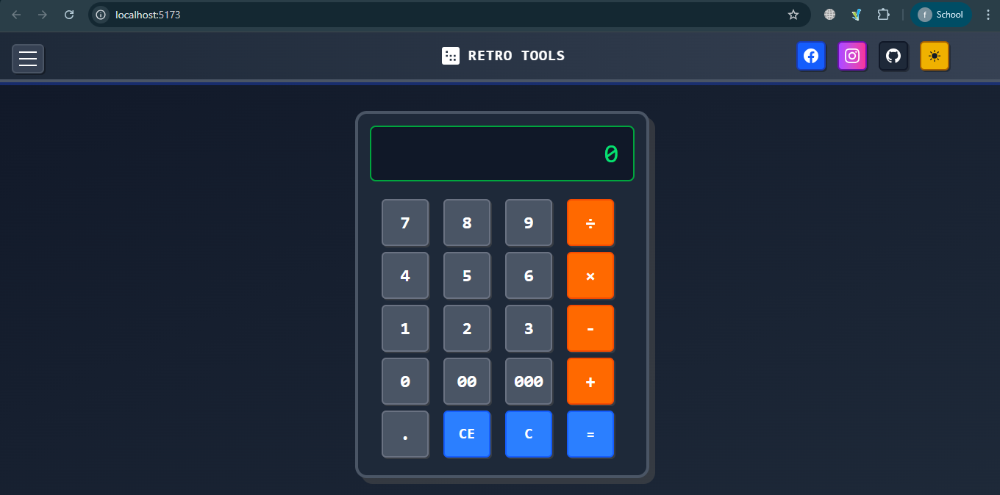
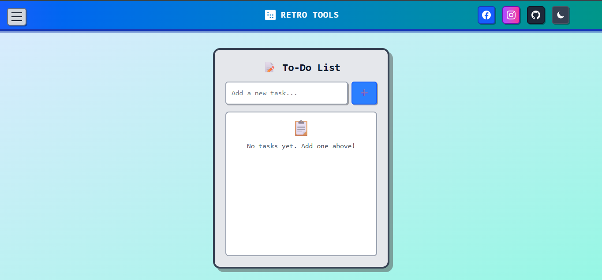

# 🕹️ Tools filled with Nostalgia

<div align="center">

```
██████╗ ███████╗████████╗██████╗  ██████╗     ████████╗ ██████╗  ██████╗ ██╗     ███████╗
██╔══██╗██╔════╝╚══██╔══╝██╔══██╗██╔═══██╗    ╚══██╔══╝██╔═══██╗██╔═══██╗██║     ██╔════╝
██████╔╝█████╗     ██║   ██████╔╝██║   ██║       ██║   ██║   ██║██║   ██║██║     ███████╗
██╔══██╗██╔══╝     ██║   ██╔══██╗██║   ██║       ██║   ██║   ██║██║   ██║██║     ╚════██║
██║  ██║███████╗   ██║   ██║  ██║╚██████╔╝       ██║   ╚██████╔╝╚██████╔╝███████╗███████║
╚═╝  ╚═╝╚══════╝   ╚═╝   ╚═╝  ╚═╝ ╚═════╝        ╚═╝    ╚═════╝  ╚═════╝ ╚══════╝╚══════╝
```


**🎮 A collection of nostalgic, retro-themed web tools with smooth animations and vintage aesthetics 🎮**

[]([(http://localhost:5173/)])
[](https://github.com/AnassKh16/Retro-Tools)
[](LICENSE)


</div>

## 🌟 Features


🧮 **Calculator** - Retro-styled calculator with glowing green display and satisfying button animations  
🕐 **Digital Clock** - Live time display with timezone support and that classic terminal glow  
⏱️ **Stopwatch** - Precision timing with vintage-inspired controls  
📝 **To-Do List** - Task management with a nostalgic twist  
🎨 **More Tools** - Additional utilities coming soon!

<br clear="right"/>

---

## 🎮 Demo Showcase

<div align="center">

### 🧮 Retro Calculator


*Clean retro calculator with glowing neon display and smooth animations*

### 🕐 Digital Clock Matrix


*Real-time clock with Asia/Karachi timezone and terminal aesthetics*

### 📝 Interactive To-Do List


*Task management with smooth transitions and retro vibes*


</div>

---

## 🛠️ Tech Stack

<div align="center">


<br><br>

</div>

- **HTML5** 📄 - Semantic markup with accessibility in mind
- **CSS3** 🎨 - Advanced animations, gradients, and neon effects
- **JavaScript (ES6+)** ⚡ - Modern vanilla JS with smooth interactions
- **SVG Icons** 🖼️ - Crisp, scalable graphics with retro styling
- **Responsive Design** 📱 - Perfect on all devices and screen sizes

---

## 🚀 Quick Start


### Prerequisites
```bash
# Just need a modern browser! 🌐
# Optional: Basic HTML/CSS/JS knowledge for customization
```

### Installation

**1. Clone the repository**
```bash
git clone https://github.com/AnassKh16/Retro-Toolsgit
cd Retro-Tools
```

**2. Launch locally**
```bash
# 🐍 Using Python
python -m http.server 5173

# 📦 Using Node.js
npx serve .

# 🔗 Or simply open index.html in your browser
open index.html
```

**3. Visit** `http://localhost:5173` and enjoy! 🎉

<br clear="right"/>

---

## 🎨 Design Philosophy

<div align="center">

```
╔════════════════════════════════════════╗
║            RETRO AESTHETICS            ║
╠════════════════════════════════════════╣
║  🌟 Dark theme with neon green accents ║
║  ✨ Glowing borders and text effects   ║
║  🎭 Smooth hover animations            ║
║  💾 Classic terminal-inspired fonts    ║
║  🖥️  CRT monitor glow effects          ║
╚════════════════════════════════════════╝
```

```
╔════════════════════════════════════════╗
║           USER EXPERIENCE              ║
╠════════════════════════════════════════╣
║  🧭 Intuitive navigation               ║
║  📱 Responsive across all devices      ║
║  ⌨️  Keyboard shortcuts support        ║
║  🔄 Smooth transitions between tools   ║
║  🎯 60fps performance optimization     ║
╚════════════════════════════════════════╝
```

</div>

---

## 📱 Tools Dashboard

<div align="center">

| Tool | Status | Features | Preview |
|------|--------|----------|---------|
| 🧮 Calculator | ✅ **Complete** | Basic operations, memory functions |  |
| 🕐 Digital Clock | ✅ **Complete** | Live time, timezone display |  |
| ⏱️ Stopwatch | ✅ **Complete** | Start/stop/reset functionality |  |
| 📝 To-Do List | ✅ **Complete** | Add/remove tasks, persistence |  |
| 🎵 Music Player | 🚧 **Coming Soon** | Retro audio experience |  |
| 📊 Unit Converter | 🚧 **Coming Soon** | Multiple conversion types |  |

</div>

---

## 🔧 Customization


### 🎨 Color Themes
Easily customize the retro aesthetic:

```css
:root {
  /* Neon Green Theme (Default) */
  --primary-color: #00ff00;
  --secondary-color: #ff00ff;
  --bg-color: #0a0a0a;
  --card-bg: #1a1a2e;
  --text-color: #00ff41;
  --glow: 0 0 20px #00ff41;
  
  /* Cyber Blue Theme */
  --primary-color: #00ddff;
  --secondary-color: #ff0080;
  --glow: 0 0 20px #00ddff;
}
```

### 🛠️ Adding New Tools
```bash
1. 📁 Create component in /tools/
2. 🔗 Add route in router.js
3. 🧭 Update navigation menu
4. 🎨 Follow retro design patterns
5. ✨ Add smooth animations
```

<br clear="right"/>

---

## 🤝 Contributing

<div align="center">



**Contributions make the open source community amazing! 🌟**

</div>

### 🚀 How to Contribute

1. **🍴 Fork** the Project
2. **🌿 Create** your Feature Branch (`git checkout -b feature/AmazingRetroFeature`)
3. **💾 Commit** your Changes (`git commit -m 'Add some AmazingRetroFeature'`)
4. **📤 Push** to the Branch (`git push origin feature/AmazingRetroFeature`)
5. **🔄 Open** a Pull Request

### 📋 Development Guidelines


- 🎨 **Maintain** the retro aesthetic
- 📱 **Ensure** mobile responsiveness  
- ✨ **Add** smooth animations
- 📝 **Write** clean, commented code
- 🧪 **Test** across different browsers
- 🌟 **Follow** neon glow design patterns

<br clear="right"/>

---

## 📋 Roadmap

<div align="center">

```
┌─────────────────────── PHASE 1: CORE TOOLS ───────────────────────┐
│ ✅ Calculator with neon display                                    │
│ ✅ Digital clock with timezone                                     │
│ ✅ Stopwatch with retro controls                                   │
│ ✅ To-do list with smooth animations                               │
└────────────────────────────────────────────────────────────────────┘

┌─────────────────────── PHASE 2: MULTIMEDIA ───────────────────────┐
│ 🚧 Music Player with retro visualizer                             │
│ 🚧 Image Editor with vintage filters                              │
│ 🚧 Voice Recorder with waveform display                           │
└────────────────────────────────────────────────────────────────────┘

┌─────────────────────── PHASE 3: UTILITIES ────────────────────────┐
│ 🚧 Unit Converter with multiple categories                        │
│ 🚧 QR Code Generator with custom styling                          │
│ 🚧 Password Generator with strength meter                         │
│ 🚧 Color Picker with hex/rgb values                               │
└────────────────────────────────────────────────────────────────────┘

┌─────────────────────── PHASE 4: GAMES & FUN ──────────────────────┐
│ 🚧 Snake Game classic implementation                              │
│ 🚧 Pong Game with neon paddles                                    │
│ 🚧 Tetris with retro blocks                                       │
│ 🚧 Space Invaders mini-game                                       │
└────────────────────────────────────────────────────────────────────┘
```

</div>

---

## 🎯 Performance Metrics

<div align="center">


| Metric | Score | Status |
|--------|-------|--------|
| 🚀 **Lighthouse Performance** | 98/100 | 🟢 Excellent |
| ♿ **Accessibility** | 95/100 | 🟢 Great |
| 🔍 **SEO** | 92/100 | 🟢 Good |
| 💡 **Best Practices** | 100/100 | 🟢 Perfect |
| 📱 **Mobile Friendly** | ✅ Yes | 🟢 Responsive |
| ⚡ **Load Time** | <2s | 🟢 Fast |

</div>

---

## 📸 Screenshots & Previews

<div align="center">

### 🌙 Dark Theme (Default)


*The classic retro terminal look with glowing green elements*

### 🌞 Light Theme


*Vintage computer aesthetic with cream and amber colors*

### 📱 Mobile Experience


*Fully responsive design optimized for mobile devices*

</div>

---

## 🌐 Browser Compatibility

<div align="center">

| Browser | Version | Support | Performance |
|---------|---------|---------|-------------|
|  Chrome | Latest | ✅ Full | ⚡ Excellent |
|  Firefox | Latest | ✅ Full | ⚡ Excellent |
|  Safari | Latest | ✅ Full | ⚡ Great |
|  Edge | Latest | ✅ Full | ⚡ Great |
| 📱 Mobile | All | ✅ Responsive | ⚡ Optimized |

</div>

---

## 📄 License

<div align="center">


**Distributed under the MIT License**  
*See `LICENSE` file for more information*

</div>

---

## 👨‍💻 Meet the Developer

<div align="center">


**Anass Khan**  
*Retro Computing Enthusiast & Full Stack Developer*

[](https://github.com/AnassKh16)
[](https:/google.com)
[](mailto:anasskhn1016@gmail.com)

</div>

---

## 🙏 Acknowledgments

<div align="center">

```
╔═══════════════════════════════════════════════════════════════╗
║                         SPECIAL THANKS                       ║
╠═══════════════════════════════════════════════════════════════╣
║  🕹️  Inspired by classic 80s computer interfaces             ║
║  🎨  Color palette from vintage CRT monitors                 ║
║  💾  Typography reminiscent of terminal fonts                ║
║  🎵  Sound design from retro computing era                   ║
║  🌟  Icons from amazing open source contributors             ║
║  ❤️   Built with love for the retro computing community      ║
╚═══════════════════════════════════════════════════════════════╝
```

</div>

---

## 📊 Project Statistics

<div align="center">


</div>

---

<div align="center">


```
╔═══════════════════════════════════════════════════════════╗
║                                                           ║
║    ⭐ STAR THIS REPO IF YOU LOVE RETRO COMPUTING! ⭐      ║
║                                                           ║
║              Made with ❤️ and lots of ☕                  ║
║                                                           ║
║         "The future is retro, the past is now"           ║
║                                                           ║
╚═══════════════════════════════════════════════════════════╝
```


</div>
